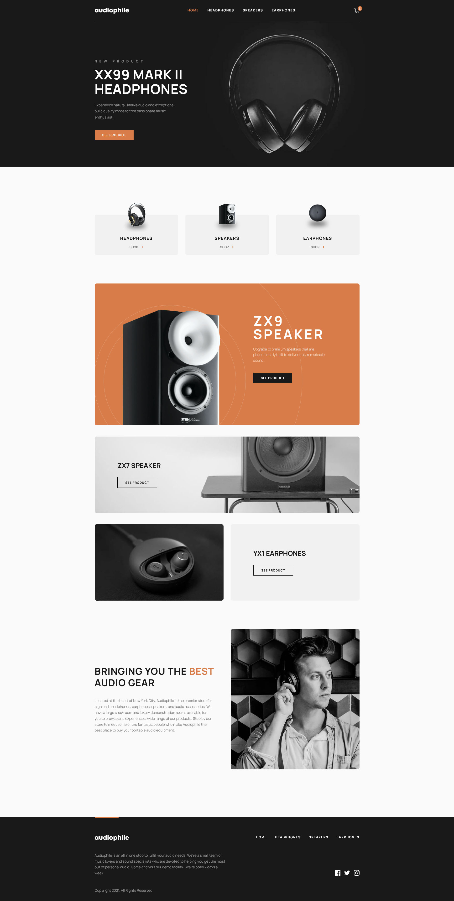

# Frontend Mentor - Audiophile e-commerce website solution

This is a solution to the [Audiophile e-commerce website challenge on Frontend Mentor](https://www.frontendmentor.io/challenges/audiophile-ecommerce-website-C8cuSd_wx). Frontend Mentor challenges help you improve your coding skills by building realistic projects.

## Table of contents

- [Overview](#overview)
  - [The challenge](#the-challenge)
  - [Screenshot](#screenshot)
  - [Links](#links)
  - [Setup](#setup)
- [My process](#my-process)
  - [Built with](#built-with)
  - [What I learned](#what-i-learned)
  - [Continued development](#continued-development)
- [Author](#author)

## Overview

### The challenge

Users should be able to:

- View the optimal layout for the app depending on their device's screen size :heavy_check_mark:
- See hover states for all interactive elements on the page :heavy_check_mark:
- Add/Remove products from the cart :heavy_check_mark:
- Edit product quantities in the cart :heavy_check_mark:
- Fill in all fields in the checkout :heavy_check_mark:
- Receive form validations if fields are missed or incorrect during checkout :heavy_check_mark:
- See correct checkout totals depending on the products in the cart :heavy_check_mark:
  - Shipping always adds $50 to the order :heavy_check_mark:
  - VAT is calculated as 20% of the product total, excluding shipping :heavy_check_mark:
- See an order confirmation modal after checking out with an order summary :heavy_check_mark:
- **Bonus**: Keep track of what's in the cart, even after refreshing the browser (`localStorage` could be used for this if you're not building out a full-stack app) :heavy_check_mark:

### Screenshot



### Links

[Live Site URL](https://audiophile-ecommerce-mbart13.vercel.app/)

### Setup

To run this project locally:

```
yarn && yarn dev
```

or

```
npm install && npm run dev
```

## My process

### Built with

- Next.js
- Chakra UI
- Redux Toolkit
- React-Hook-Form
- Framer-Motion
- React-Intersection-Observer
- TypeScript
- Atomic Design System
- Mobile-first workflow

### What I learned

#### Chakra-UI

For this project I wanted for the first time to try out some component library, before I mainly used Styled Components. I considered Theme UI, Material UI and Chakra UI. I decided to go with Chakra UI, because they create their components with accessibility in mind and it was used by Lee Robinson in his Next.js tutorials.
I really recommend it if you are a fan of CSS-in-JS like me. The main features I like about it are:

- it provides default breakpoints: base, sm: "30em", md: "48em", lg: "62em" (you can customize them and add more),
- under hood it uses @media(min-width) media query to ensure interfaces are mobile-first.
- it makes responsive styles really easy to do with the way how you define media queries, as an object or array:

```js
    <Stack
      as="ul"
      spacing={{ base: '1rem', md: '2.125rem' }}
      direction={{ base: 'column', sm: 'row' }}
    >
```

Here 'base' means this style will apply when viewport width is from 0em to 30em (mobile), 'sm' will apply to tablet and higher and so on. You can read more in their [documentation](https://chakra-ui.com/docs/features/responsive-styles).

The "as" prop that you see above is also very useful and similarly like in Styled-Components it lets you replace default 'div' of 'Stack' component with any HTML element.

Another advantage of Chakra-UI is that it provides custom hooks. For example, useDisclosure is a hook that I used for opening, closing, and toggling of modals.

#### Next.js

Next.js is a great framework built on top of React, that has features like file-based routing, static & server rendering, TypeScript support and many more with no configuration.
The basic way of pre-fetching data is with a function called getStaticProps. Next.js will pre-render the page at build time using the props returned by this function. All data in the application like products details comes from products.json file prepared by Frontend Mentor team and slightly modified by me.

One problem that I encountered had to do with styling of the currently active link in navigation menu and adding aria-current="page" attribute. With React and React Router it was easy as it comes with special NavLink component. In Next.js it's not so easy, according to [this stack overflow answer](https://stackoverflow.com/questions/53262263/target-active-link-when-the-route-is-active-in-next-js) it requires creating your own component that would wrap Next's 'Link' component. This seemed overly complicated to me and was wondering if there is an easier way.

Then I figured that I'm already using array of objects representing navlinks that I can iterate over in a few places in my application (header, footer, secondary nav) that looks like this:

```js
export const links = [
  {
    id: 1,
    text: 'home',
    url: '/',
  },
  {
    id: 2,
    text: 'Headphones',
    url: '/headphones',
    img: '/images/shared/desktop/image-headphones.png',
  },
  {
    id: 3,
    text: 'Speakers',
    url: '/speakers',
    img: '/images/shared/desktop/image-speakers.png',
  },
  {
    id: 4,
    text: 'Earphones',
    url: '/earphones',
    img: '/images/shared/desktop/image-earphones.png',
  },
]
```

I realized I can easily use it to style active link. All I had to do was to use useRouter hook that comes with next.js and returns [the path (including the query) shown in the browser](https://nextjs.org/docs/api-reference/next/router) and add this line to the existing code: 'color={asPath === link.url ? 'accent' : 'white'}
However, adding 'aria-current' attribute required creating custom wrapper, so in the end NavLinks component ended up looking like this:

```js
import Link from 'next/link'
import { useRouter } from 'next/router'

import { links } from 'utils/links'

const NavLinks = (): JSX.Element => {
  const { asPath } = useRouter()

  return (
    <Box as="nav" display={{ base: 'none', lg: 'block' }}>
      <HStack as="ul" display="flex" spacing={9} listStyleType="none">
        {links.map(link => (
          <Box
            as="li"
            fontSize="sm"
            fontWeight="bold"
            _hover={{ color: 'accent' }}
            transition="color 0.2s linear"
            letterSpacing="0.125em"
            key={link.id}
            color={asPath === link.url ? 'accent' : 'white'}
            textTransform="uppercase"
          >
            <Link href={link.url}>{link.text}</Link>
          </Box>
        ))}
      </HStack>
    </Box>
  )
}

const NavLink: React.FC<{ href: string; active: boolean }> = ({
  href,
  active,
  children,
}): JSX.Element => {
  const child = React.Children.only(children)

  return (
    <Link href={href} passHref>
      {React.cloneElement(child as React.ReactElement, {
        'aria-current': active ? 'page' : null,
      })}
    </Link>
  )
}

export default NavLinks
```

#### Redux Toolkit

Redux is one of the oldest and most popular state management libraries for React applications, and although currently there are [many alternatives](https://leerob.io/blog/react-state-management) to choose from, in job listings for React positions you will see Redux more often than others.
Redux Toolkit is a library that makes working with Redux a lot easier, as it eliminates a lot of boilerplate. With Redux Toolkit you can create so called slices (pieces of state in your application) that combine action creators and reducers. It automatically sets up Redux DevTools by default.
It also allows you to update state in a 'mutating way' thanks to Immer library it uses under the hood.
In the application I'm using Redux to hold mostly state of cart, persist it to local storage and retrieve it when the app is loaded.  
Dan Abramov, creator of Redux, recommends subscribing to store to persist data to local storage. So that's the approach I followed. You can read more about it [here](https://stackoverflow.com/questions/35305661/where-to-write-to-localstorage-in-a-redux-app).

#### Accessibility

To prevent form from being submitted when cart is empty I used aria-disabled instead of 'disabled'. Using an aria attribute will make disabled buttons [more inclusive](https://css-tricks.com/making-disabled-buttons-more-inclusive/).

I also added 'Skip to content' link, it lets keyboard users and screen readers jump from the top of the page to the main content without have to go through other elements in the navigation menu.

### Continued development

Create unit and integration tests with Jest/React-Testing-Library.

## Author

- Frontend Mentor - [@mbart13](https://www.frontendmentor.io/profile/mbart13)
